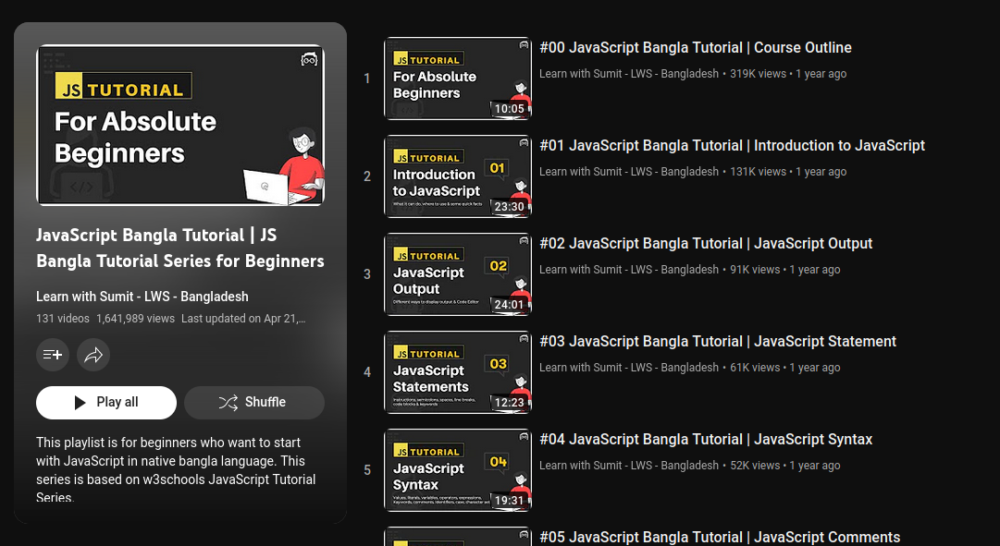

### JS-Journey

### Playlist 1

    https://www.youtube.com/playlist?list=PLHiZ4m8vCp9OkrURufHpGUUTBjJhO9Ghy

### Playlist 2

    https://www.youtube.com/playlist?list=PLHiZ4m8vCp9MJDxMOzhYVuTrO1b5n-Tq_

### Playlist 3

    https://www.youtube.com/playlist?list=PLHiZ4m8vCp9MFjMRp9EEHWKArbi0wdgXG

### Playlist 4

    https://www.youtube.com/playlist?list=PLHiZ4m8vCp9Nflbo9a0pZuLscG_Xc7DKq

### Playlist 5

    https://www.youtube.com/playlist?list=PLHiZ4m8vCp9PHnOIT7gd30PCBoYCpGoQM

### Playlist 6

    https://www.youtube.com/playlist?list=PLHiZ4m8vCp9OmVWU2Qf9tZgKdyzoubOpj

### git command
    git add . && git commit -m "Day 1" && git push -u origin main